# INFRAESTRUTURA E SERVIÇOS DE REDES
Desenvolvimento de rede de computador virtualizada.
## Dados da equipe e do professor

```
Equipe 6: 
Lívia Maria Figueiroa Dos Santos
Silvana Silva Farias 
Matheus de Melo Santos
Tayllane Barbosa Santos    
Turma: 924
Professor: Alaelson Jatobá
```

# Configuração de Interface de Rede


<p><center> Tabela 1: Definições da rede interna grupo 6, 924</center></p>

| DESCRIÇÃO   | IP             |
|:------------|:---------------| 
| rede        | 10.9.24.0      |
| máscara     | 255.255.255.0  |
| Gateway     | 10.9.24.120    |
| Broadcast   | 10.9.24.255    |
| NameServer1 | 10.9.24.113    |
| NameServer2 | 10.9.24.121    |
| Samba       | 10.9.24.115    |
| BD          | 10.9.24.222    | 


Os nomes das máquinas ou dispositivos que serão configuradas no DNS deverão ser nomeados de acordo com o domínio. A Tabela 2 apresenta os nomes das máquinas para o domínio de exemplo.

<p><center> Tabela 2: Definições do domínio: <b>name.grupoX.turma.ifalarapiraca.local</b></center></p>

|      Apelido      |               NOME               |
|:------------------|:---------------------------------|
| gateway (gw)      | gw.grupo6.turma924.ifalarapiraca.local    |
| nameserver1 (ns1) | ns1.grupo6.turma924.ifalarapiraca.local   |
| nameserver2 (ns2) | ns2.grupo6.turma924.ifalarapiraca.local   |
| hostsamba   (hs1) | samba.grupo6.turma924.ifalarapiraca.local |

- [Clique Aqui Para ver a Planilha detalhada](https://docs.google.com/spreadsheets/d/14w_kkyJeZiC50_NOaJPD21q7aiylo4qtkw7SilrcD3U/edit?hl=pt-br#gid=0)

## Configuração estática do DNS na interface de rede. 

* Para que a máquina acesse os sites e hosts remotos por meio de nomes (Ex. www.google.com) é necessário adcionar os nameservers na configuração da interface de rede.
* Para isso é configure o arquivo YAML que encontra-se na pasta **/etc/netplan/**.
* Verifique o nome correto do arquivo no seu servidor. No exemplo a seguir, o nome do arquivo é ***00-installer-config.yaml***

-  Edite o arquivo  ***00-installer-config.yaml*** 

```bash
$ sudo nano /etc/netplan/00-installer-config.yaml
```

-  Adicione as linhas para a configuração estática do IP. [Baixe o arquivo 00-installer-config.yaml](https://github.com/alaelson/labredes2020/blob/master/network/interface-config/00-installer-config.yaml)
```
network:
  ethernets:
    ens160:
      dhcp4: false
      addresses: [10.9.24.113/24]
      gateway4: 10.9.24.1
      nameservers:
          addresses:
           - 10.9.24.113
           - 10.9.24.121
          search: [grupo6.turma924.ifalara.local]
    ens192:
          addresses: [192.168.24.46/29]
  version: 2

```
-  Após salvar o arquivo é necessário aplicar as configurações, com o **netplan apply**. Depois veja a configuração das interfaces com ****ifconfig -a***

```bash
$ sudo netplan apply
$ ifconfig -a
```
-  Adicione as linhas para a configuração estática do IP. [Baixe o arquivo 00-installer-config.yaml](https://github.com/alaelson/labredes2020/blob/master/network/interface-config/00-installer-config.yaml)

```
network:
  ethernets:
    ens160:
      dhcp4: false
      addresses: [10.9.24.113/24]
      gateway4: 10.9.24.1
      nameservers:
          addresses:
           - 10.9.24.113
           - 10.9.24.121
          search: [grupo6.turma924.ifalara.local]
    ens192:
          addresses: [192.168.24.46/29]
  version: 2

```
-  Após salvar o arquivo, aplique as novas configurações, com o **netplan apply**. Depois veja a configuração das interfaces com ****ifconfig -a***

```bash
$ sudo netplan apply
$ ifconfig -a


```bash
$ sudo systemctl enable bind9
```
## 4. Implementação dos Serivços de Rede (Cada serviço uma sessão)
   ## *4.2 Configurando o DNS Master:*
   
### Instalação necessária do Bind9 
   * Vale ressaltar que o BIND9 é a aplicação de DNS que roda no servidor.
   * Para instalar o bind9 de forma fácil é via comando:
```bash
$ sudo apt-get install bind9 dnsutils bind9-doc 
```
   * Verifique o status do serviço:
```bash
$ sudo systemctl status bind9
```
   * Se não estiver rodando:
```bash
$ sudo systemctl enable bind9


## Diretórios do bind
   * Os arquivos do bind ficam na no diretório **/etc/bind**. 
```bash
$ ls /etc/bind
```
```
bind.keys  
db.0  
db.127  
db.255  
db.empty 
db.local
named.conf  
named.conf.default-zones 
named.conf.local 
named.conf.options 
rndc.key  
zones  
zones.rfc1918

```

### Zonas
   * As zonas são especificadas em arquivos **db**. Vamos criar um diretório para armazendar os arquivos de zonas, que sera o diretório ***/etc/bind/zones***  
```bash
$ sudo mkdir /etc/bind/zones
```

#### Criar arquivos db
   * Criar o arquivo **db** no diretório ***/etc/bind/zones***. 
   * Os arquivos **db** são bancos de dados de resolução de nomes, ou seja, quando se sabe o nome da máquina mas não se conhece o IP. Cada zona no DNS deve ter seu próprio arquivo **db**, por exemplo: a zona *meusite.com.br* terá o arquivo **db.meusite.com.br**, já a zona *outrosite.net* terá o arquivo **db.outrosite.net**. 
   * No nosso caso o domínio/zona local será grupo5.turma924.ifalara.local. Assim o arquivo db será db.labredes.ifalarapiraca.local
   
##### zona direta
   * o arquivo db.grupo6.turma924.ifalara.local conterá os nomes das máquinas do domínio grupo5.turma924.ifalara.local
   * Para isso faremos uma cópia do arquivo /etc/bind/db.empty
```bash
$ sudo cp /etc/bind/db.empty /etc/bind/zones/db.grupo5.turma924.ifalara.local 
```

##### zona reversa
   * Utilizado quando não se conhece o IP mas sabe-se o nome do host.
   * vamos criar a zona reversa a partir do arquivo /etc/bind/db.127
```bash
  $ sudo cp /etc/bind/db.127 /etc/bind/zones/db.10.9.24.rev
```

   * Assim, o arquivo **db.10.9.24.rev** conterá a zona reversa da rede 10.9.24.0. 

   
### Editar arquivos db:

   #### zona direta: db.grupo6.turma924.ifalara.local
   * edite o arquivo  **db.grupo6.turma924.ifalara.local** para adcionar as informações do seu domínio
      
```bash   
    $ sudo nano db.grupo5.turma924.ifalara.local
```
---
```


;

;
; BIND data file for internal network
;
$ORIGIN grupo6.turma924.ifalara.local.
$TTL    3h
@       IN      SOA     ns1.grupo6.turma924.ifalara.local. root.grupo6.turma924>
                              2022031401                ; Serial
                              3h        ; Refresh
                              1h        ; Retry
                              1w        ; Expire
                              1h )      ; Negative Cache TTL
;nameservers
@       IN      NS      ns1.grupo6.turma924.ifalara.local.
@       IN      NS      ns2.grupo6.turma924.ifalara.local.
;hosts
ns1.grupo6.turma924.ifalara.local.        IN    A       10.9.24.113
ns2.grupo6.turma924.ifalara.local.        IN    A       10.9.24.121
gw.grupo6.turma924.ifalara.local.         IN    A       10.9.24.120
www.grupo6.turma924.ifalara.local.        IN    A       10.9.24.221
bd.grupo6.turma924.ifalara.local.         IN    A       10.9.24.222

```

---
   #### zona reversa: db.10.9.24.rev
   * edite o arquivo **db.10.9.24.rev** para adcionar as informações da zona reversa
   
---
```
;

; BIND reverse data file for local loopback interface
;
$TTL    60
@       IN      SOA     ns1.grupo6.turma924.ifalara.local. root.grupo6.turma924>
                              3         ; Serial
                         604800         ; Refresh
                          86400         ; Retry
                        2419200         ; Expire
                         604800 )       ; Negative Cache TTL
;
@       IN      NS      ns1.grupo6.turma924.ifalara.local.
@       IN      NS      ns2.grupo6.turma924.ifalara.local.

113     IN      PTR     ns1.grupo6.turma924.ifalara.local.
121     IN      PTR     ns2.grupo6.turma924.ifalara.local.
120     IN      PTR     gw.grupo6.turma924.ifalara.local.
115     IN      PTR     samba.grupo6.turma924.ifalara.local
222     IN      PTR     bd.grupo6.turma924.ifalara.local
221     IN      PTR     www.grupo6.turma924.ifalara.local


```
---

## Configuração do DNS Slave 

1. Primeiro, é necessário usar o ns1 para fazer com que o ns2 acesse a rede de Internet. Configure a interface de rede com o comando:
```
netplan
$ sudo nano /etc/netplan/00-instaler-config.yaml 
```
Ela deve ficar assim:
```
network:
    ethernets:
        ens160:                        # interface local
            addresses: [10.9.14.255/24]  # ip/mascara
            gateway4: 10.9.24.1         # ip do gateway
            dhcp4: false               # 'false' para conf. estatica 
            nameservers:               # servidores dns
                addresses:
                - 10.9.14.113            # ip do ns1
                - 10.9.14.121           # ip do ns2
                search: [labredes.ifalarapiraca.local]  # domínio
    version: 2
```
2. Configure com: 
```
$ sudo netplan apply
```
3. Dê ifconfig:
```
$ ifconfig
```
4. Instale o DNS Slave:
```
$ sudo apt-get install bind9 dnsutils bind9-doc -y
```
5. Veja se está pegando:
```
$ sudo systemctl status bind9
```
6. Senão estiver rodando, teste novamente com:
```
$ sudo systemctl enable bind9
```
7. Agora, é necessário configurar as zonas. Digite o comando:
```
$ sudo nano /etc/bind/named.conf.local
```
E a deixe assim:
```
zone "grupo6.turma924.ifalara.local" {
  type slave;
  file "/etc/bind/zones/db.grupo6.turma924.ifalara.local";
  masters { 10.9.24.113; };
};

zone "14.9.10.in-addr.arpa" IN {
  type slave;
  file "/etc/bind/zones/db.10.9.24.rev";
  masters { 10.9.14.121; };
};
```
8. Cheque se está tudo bem com:
```  
$ sudo named-checkconf
```
9. Use o comando dig para resolver algum hostname
```
$ dig @10.9.24.113 ns1.grupo6.turma924.ifalara.local
```
10. Veja a resposta em ANSWER SECTION, pronto! Slave instalado. 

## Configuração do samba

1.  Após conectar-se ao OpenVPN, abra o programa PuTTY e insira o endereço IP da sua máquina virtual. Exemplo: 10.9.24.113
2.  Após abrir, entre com o usuário administrador e senha adminifal. 
```
  user: administrador
  password: adminifal
```
3. No usuário administrador, digite o comando:
``` 
$ sudo apt update
```
Para baixar e atualizar as listas de pacotes, e depois: 
```
$ sudo apt install samba
```
Para instalar o servidor Samba. Após a instalação, use o comando:
```
$ whereis samba
```
Para verificar se ele foi mesmo instalado. 
4. É necessário realizar o backup do arquivo smb.conf 
```
$ sudo cp /etc/samba/smb.conf{,.backup}
``` 
E fazer um novo arquivo com:
```
$ sudo bash -c 'grep -v -E "^#|^;" /etc/samba/smb.conf.backup | grep . > /etc/samba/smb.conf
```
5. Agora, adicionamos a linha onde as interfaces da nossa VM se encontram para que o servidor possa se comunicar, com o comando: 
```
$ sudo nano /etc/samba/smb.conf
```
Como as nossas interfaces são ens160 e ens192, as adicionamos com espaços. Lembre-se sempre de salvar o arquivo após modificá-lo com Crtl + X e Enter: 

6. Após adicionar a linha e salvar o arquivo, é necessário reiniciar o sistema com o comando
 ```
 $ sudo systemctl restart smbd
 ``` 
para que funcione. Agora, é preciso criar um usuário dentro da máquina para que assim haja o compartilhamento de arquivos. O nome de usuário pode ser qualquer um, desde que não possua letras maiúsculas nem caracteres especiais. O adicionamos com o comando 
```
$ sudo adduser <digite seu nome>
```
Defina uma senha e repita-a para a confirmação. Após realizar estes passos, use o comando 
```
$ su <digite seu nome>
```
para ter acesso ao seu usuário
```
$ pwd
``` 
para ter acesso ao home do usuário 
e use o comando ```$ mkdir /<digite seu nome>/sambashare```
para criar o diretório sambashare. Para verificar se o sambashare foi criado, teste com o comando 
```
$ ls -la
```

7. Agora, para tornar o sambashare público, use o comando ``$ mkdir -p /samba/public/`` Chegamos aos últimos passos da instalação do Samba! Apenas modifique as configurações com esses três comandos: 

```
$ sudo chown -R nobody:nogroup /samba/public
$ sudo chmod -R 0775 /samba/public
$ sudo chgrp sambashare /samba/public
```
8. Teste no Explorador de Arquivos: utilize seu IP na parte esquerda a barra de pesquisa e clique em public > digite nome e senha > se acessar a pasta public, a instalação foi bem sucedida. 

## Antes de Darmos prosseguimento a implementação das novas VM's tomaremos como base as seguintes definições:
### Definições de IP de Rede:

| DESCRIÇÃO   | ens160         | ens192         |
|:------------|:---------------| ---------------|
| rede        | 10.9.24.0/24   | 192.168.24.41  |
| Gateway     | 10.9.24.120    | 192.168.24.41  |
| Broadcast   | 10.9.24.255/24 | 192.168.24.47  |
| NameServer1 | 10.9.24.113    | 192.168.24.46  |
| NameServer2 | 10.9.24.121    | 192.168.24.47  |
| Samba       | 10.9.24.115    | 192.168.24.42  |
| Server BD   | 10.9.24.222    | 192.168.24.43  |
| server LAMP | 10.9.24.221    | 192.168.24.44  |

### Definições de Dominios de nossas VM's

| Nome        | Dominio                             |
|-------------|-------------------------------------|
| Gateway     | gw.grupo6.turma924.ifalara.local    |
| NameServer1 | ns1.grupo6.turma924.ifalara.local   |
| NameServer2 | ns2.grupo6.turma924.ifalara.local   |
| Samba       | samba.grupo6.turma924.ifalara.local |
| Server LAMP | www.grupo6.turma924.ifalara.local   |
| Server BD   | bd.grupo6.turma924.ifalara.local    |


## Instalação do LAMP 

1. Para se instalar o servidor LAMP, primeiro é necessário ir a máquina www. 
 
2. Depois, atualize os pacotes com o comando: 
```
$ sudo apt update | sudo apt upgrade -y
```
3. Para instalar o Apache:
```
$ sudo apt install -y apache2 apache2-utils
```
4. Verifique se está tudo ok com ``$systemctl status apache2``
```
$systemctl status apache2
```
```
$ systemctl status apache2
● apache2.service - The Apache HTTP Server
     Loaded: loaded (/lib/systemd/system/apache2.service; enabled; vendor preset: enabled)
     Active: active (running) since Sun 2022-03-06 19:19:04 UTC; 24s ago
       Docs: https://httpd.apache.org/docs/2.4/
   Main PID: 10597 (apache2)
      Tasks: 55 (limit: 462)
     Memory: 5.3M
     CGroup: /system.slice/apache2.service
             ├─10597 /usr/sbin/apache2 -k start
             ├─10599 /usr/sbin/apache2 -k start
             └─10600 /usr/sbin/apache2 -k start

Mar 06 19:19:04 ubuntu-server-lts systemd[1]: Starting The Apache HTTP Server...
Mar 06 19:19:04 ubuntu-server-lts apachectl[10596]: AH00558: apache2: Could not reliably determine the server's>
Mar 06 19:19:04 ubuntu-server-lts systemd[1]: Started The Apache HTTP Server.
```
5. Caso não esteja pegando na sua máquina:
```
sudo systemctl start apache2
```
6. Para que ele inicie automaticamente na máquina:
```
$ sudo systemctl enable apache2
```
```$ systemctl enable apache2
Synchronizing state of apache2.service with SysV service script with /lib/systemd/systemd-sysv-install.
Executing: /lib/systemd/systemd-sysv-install enable apache2
==== AUTHENTICATING FOR org.freedesktop.systemd1.reload-daemon ===
Authentication is required to reload the systemd state.
Authenticating as: Administrador (administrador)
Password: 
==== AUTHENTICATION COMPLETE ===
```
7. É necessário pôr o usuário do Apache como o proprietário da raiz do documento/raiz da web.
```
sudo chown www-data:www-data /var/www/html/ -R 
$ ls -la /var/www
drwxr-xr-x  2 www-data www-data 4096 Mar  7 15:21 html
```
8. Quando se executa o comando ``apache2ctl -t`` acontece um erro, por isso se faz necessário uma correção. Para corrigir, modifica a alteração global para ServerName. 
```
$ sudo tourch /etc/apache2/conf-available/servername.conf
```
9. Escreva no arquivo servername.conf:
```
sudo nano ServerName localhost
```
10. Salve e feche o arquivo e em seguida digite o comando:
```
sudo a2enconf servername.conf
```
11. Recarregue com o comando:
```
sudo systemctl reload apache2
```
12. Verifique se está tudo ok:
```
$ apache2ctl -t 
```
13. Acesse seu site com seu ip:
```
http://10.9.14.221
```
## Configurando o Servidor Web

1. Atualize os pacotes: 
```
$ sudo apt update | sudo apt upgrade -y
```
2. Instale com o comando: 
```
$ sudo apt install php7.4 libapache2-mod-php7.4 php7.4-mysql php-common php7.4-cli php7.4-common php7.4-common php7.4-json php7.4-opcache php7.4-readline
```
3. O carregue e reinicie o sistema: 
```
sudo a2enmod php7.4

sudo systemctl restart apache2
```
4. Agora, é preciso se fazer uma página info para testes:
```
sudo touch /var/www/html/info.php
```
5. Edite o arquivo e adicione:
```
<?php phpinfo(); ?>
```
6. Agora, acesse o site com o ip: 
```
http://10.9.14.221/info.php
```
## Configurando o Servidor MYSQL

1. Atualize os pacotes:
```
$ sudo apt update | sudo apt upgrade -y
```
2. Instale o MYSQL:
```
$ sudo apt install mysql-server
```
3. Veja se está tudo ok:
```
$ systemctl status mysql
```
4. Para verificar as conexões, use:
```
$ netstat -an | grep LISTEN
```
5. Edite o arquivo ``/etc/mysql/mysql.conf.d/mysqld.cnf`` para:
```
# localhost which is more compatible and is not less secure.
bind-address            = 0.0.0.0
mysqlx-bind-address     = 0.0.0.0
```
6. Reinicie o MYSQL:
```
$ systemctl restart mysql
```
7. Ponha senha no MYSQL com ``mysql_secure_installation``:
```
$ sudo mysql_secure_installation

Securing the MySQL server deployment.

Connecting to MySQL using a blank password.

VALIDATE PASSWORD COMPONENT can be used to test passwords
and improve security. It checks the strength of password
and allows the users to set only those passwords which are
secure enough. Would you like to setup VALIDATE PASSWORD component?

Press y|Y for Yes, any other key for No:
```
8. Digite y para sim e digite 2 para uma senha forte. Em seguida, digite a senha e responda o resto. 
```
Please set the password for root here.

New password: 

Re-enter new password: 

Estimated strength of the password: 100 
Do you wish to continue with the password provided?(Press y|Y for Yes, any other key for No) : y
By default, a MySQL installation has an anonymous user,
allowing anyone to log into MySQL without having to have
a user account created for them. This is intended only for
testing, and to make the installation go a bit smoother.
You should remove them before moving into a production
environment.

Remove anonymous users? (Press y|Y for Yes, any other key for No) : y
Success.


Normally, root should only be allowed to connect from
'localhost'. This ensures that someone cannot guess at
the root password from the network.

Disallow root login remotely? (Press y|Y for Yes, any other key for No) : y
Success.

By default, MySQL comes with a database named 'test' that
anyone can access. This is also intended only for testing,
and should be removed before moving into a production
environment.


Remove test database and access to it? (Press y|Y for Yes, any other key for No) : n

 ... skipping.
Reloading the privilege tables will ensure that all changes
made so far will take effect immediately.

Reload privilege tables now? (Press y|Y for Yes, any other key for No) : y
Success.

All done! 
```
9. Digite ``$ sudo mysql`` para iniciá-lo e depois digite ``exit`` para sair do terminal.  

## Configurando o Virtual-Host no Apache 

1. No servidor www.grupo6.turma924.ifalara.local digite o comando: 
```
$ cd /etc/apache2/sites-available
$ ls -la
-rw-r--r-- 1 root root 1332 Mar 12 15:02 000-default.conf
-rw-r--r-- 1 root root 6338 Sep 30  2020 default-ssl.conf
```
2. Faça uma cópia do arquivo ``000-default.conf`` para o www.grupo6.turma924.ifalara.local.conf:
```
$ cp 000-default.conf www.grupo6.turma924.ifalara.local.conf
```
3. Edite o arquivo www.grupo6.turma924.ifalara.local.conf com vi ou sudo nano e adiciona as seguintes linhas:
```
<VirtualHost *:80>
	ServerAdmin webmaster@localhost                              # Pessoa que administra o site
	DocumentRoot /var/www/www.grupo6.turma924.ifalara.local      # Diretório onde os arquivos do site ficarão
	ServerName www.grupo6.turma924.ifalara.local                 # Nome do servidor, ou seja, a url raíz do site.
<\VirtualHost>
```
4. Digite o comando ``$ sudo a2ensite www.grupo6.turma924.ifalara.local.conf`` para habilitar seu arquivo. 
```
$ sudo a2ensite www.grupox.turma914.ifalara.local.conf
Enabling site www.grupox.turma914.ifalara.local.
To activate the new configuration, you need to run:
  systemctl reload apache2
```
5. Reinicie a máquina virtual: 
```
$ sudo systemclt reload apache2
```
6. Crie o diretório que vai obter os arquivos do site:
```
$ cd /var/www/
$ sudo mkdir www.grupox.turma914.ifalara.local
$ ls -la
```
7. Altere as permissões de proprietário do diretório: 
```
$ cd /var/www
$ chown -R www-data:www-data www.grupox.turma914.ifalara.local
```
8. Reinicie a máquina novamente e coloque os arquivos da página dentro do diretório ``DocumentRoot``:
```
$ sudo systemclt reload apache2
```
## Script para database demo 

1. Acesse a máquina virtual do BD. 

2. Digite o seguinte comando para carregar o script dentro do seu banco de dados:
```
$ sudo mysql
mysql> source createdb.sql
mysql> exit
```
3. Crie a database ``projetofinal_sred`` e em seguida, crie as tabelas grupo, aluno e host:
```
mysql> select * from grupo;
+-----+----------+--------------------------------+
| GID | Nome     | Dominio                        |
+-----+----------+--------------------------------+
|  06 | Grupo  6 | grupo6.turma924.ifalara.local  |
+-----+----------+--------------------------------+

mysql> select * from aluno;
+-----+-----------------+-------------------------+-------+
| UID | Nome            | Email                   | GID   |
+-----+-----------------+-------------------------+-------+
|  13 | Livia Maria F.  | lmfs1@aluno.ifal.edu.br |  6    |
+-----+-----------------+-------------------------+-------+
|  15 | Matheus Melo    | @mms11@aluno.ifal.edu.br|  6    |
+-----+-----------------+-------------------------+-------+
|  20 | Silvana Farias  | @ssf4@aluno.ifal.edu.br |  6    |
+-----+-----------------+-------------------------+-------+
|  21 | Tayllane Barbosa| @tbs4@aluno.ifal.edu.br |  6    |
+-----+-----------------+-------------------------+-------+

mysql> select * from host;
+-----+--------------+------------------------------------+------+
| HID | VmName       | FQDName                            | GID  |
+-----+--------------+------------------------------------+------+
|   6 | Servidor Web | www.grupo6.turma924.ifalara.local  |  6   |
+-----+--------------+------------------------------------+------+
```
4. Descompacte o arquivo script_teste_db.zip 
```
 $ sudo apt install zip unzip -y
```
5. Agora, é só executar os scripts de teste!

## Site Demo para Integração do Serviço LAMP

1. Faça o download do Site Demo após as configuração do Virtual-Host no apache e da Configuração e Teste do Servidor de Banco de dados.
2. Baixe um programa sFTP e envie o arquivo zip para o servidor DB: como Filezilla ou o WinSCP.
3. Faça a conexão ao servidor usando a porta 22 (ssh) ou especifique o protocolo sFTP.
4. Procure o arquivo zip que foi baixado e arraste e solte (drag and drop) no servidor remoto.
<p><center> Figura 1: Exemplo de uso do Filezilla para enviar um arquivo via sFTP para o servidor</center></p>   
   

5. Depois descompacte todos os arquivos no seu diretório e copie para o ``DocumentoRoot`` do site no servidor web.

```bash
$ unzip www.grupo6.turma914.ifalara.local.zip
$ sudo cp -r www.grupo6.turma914.ifalara.local /var/www/
```
6. Faça as modificação das propriedade da pasta para o usuário do apache ``www-data``.
```bash
$ sudo chown www-data:www-data /var/www/www.grupo6.turma914.ifalara.local
$ ls -la /var/www/
total 16
drwxr-xr-x  4 root     root     4096 Mar 12 14:45 .
drwxr-xr-x 14 root     root     4096 Mar  6 19:18 ..
drwxr-xr-x  2 www-data www-data 4096 Mar 12 14:48 html
drwxr-xr-x  3 www-data www-data 4096 Mar 12 23:08 www.grupox.turma914.ifalara.local
```


###  Imagens do Site Demo:

1 - Home Page
<p><center> Figura 1: Execução do arquivo ``index.html`` no browser</center></p>   
   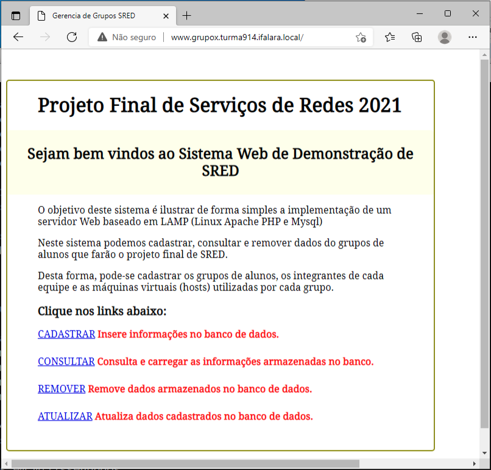
2 - Cadastrar Dados 
<p><center> Figura 2: execução do arquivo ``insert.html`` no browser</center></p>   
   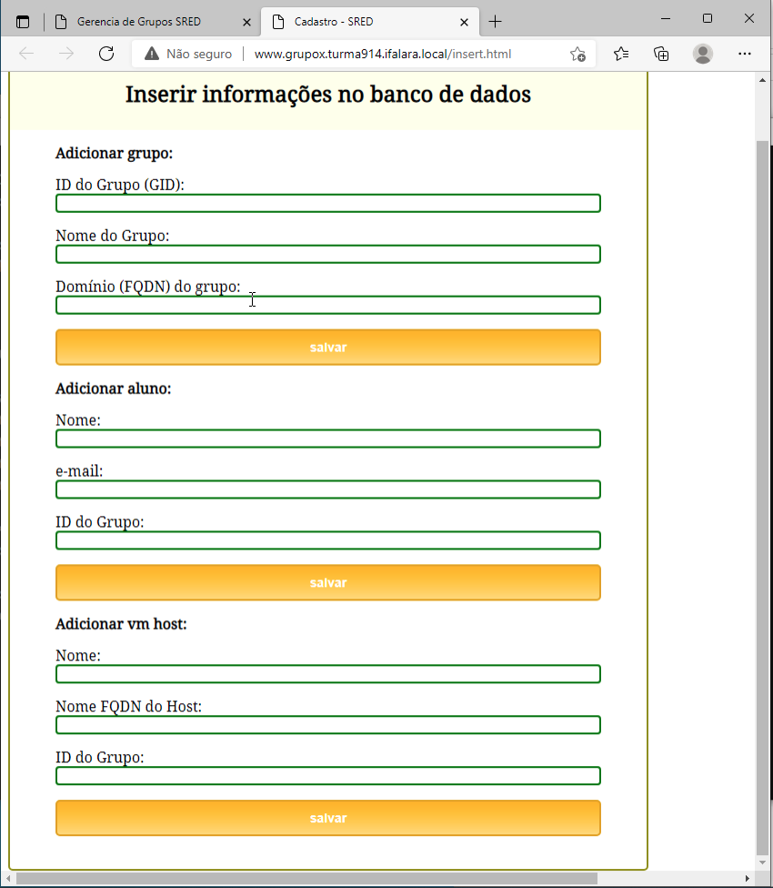
3 - Consultar Dados
<p><center> Figura 3: execução do arquivo de consulta ``consult.php`` no browser</center></p>   
   
4 - Atualizar Dados
<p><center> Figura 4: execução do arquivo de atualização ``update.html`` no browser</center></p>   
   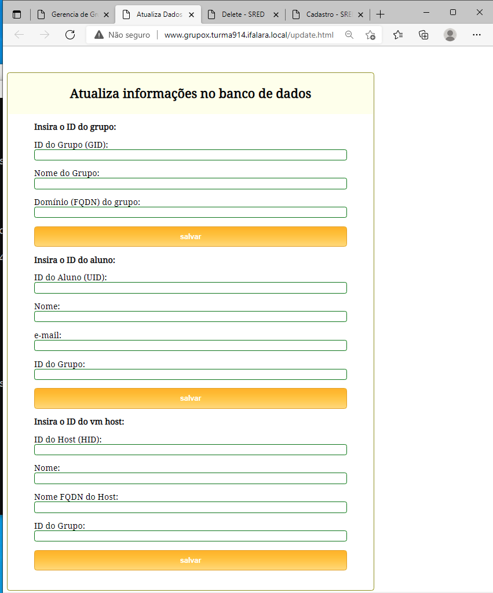
5 - Deletar Dados
<p><center> Figura 5: execução do arquivo de atualização ``update.html`` no browser</center></p>   
   

## Configuração do servidor Gateway como NAT

## Configuração do firewall/NAT

### habilitar o firewall 
   
   1. Habilite o firewall e permita o acesso ssh:
```bash
 $ sudo ufw enable
 $ sudo ufw allow ssh
```
   2. Habilite o encaminhamento de pacotes das interfaces WAN para LAN e ajuste os parâmetros no arquivo **/etc/ufw/sysctl.conf**, removendo-se a marca de comentário (#) da seguinte linha _# net/ipv4/ip_forwarding=1_

```bash
$ sudo nano /etc/ufw/sysctl.conf
``` 
```
...
net/ipv4/ip_forwarding=1
...
```

   3. Confira o nome das interfaces de rede
```bash
$ ifconfig -a
```
```
WAN interface: enp0s3 
LAN interface: enp0s8
```

   4. Configure as interfaces de rede (netplan) 

```bash
$ sudo nano /etc/netplan/50-cloud-init.yaml 
```

```
network:
    ethernets:
        enp0s3:
            dhcp4: true
        enp0s8:
            addresses: [10.0.0.1/24]
            dhcp4: false              
    version: 2
```

```bash
$ sudo netplan apply
$ ifconfig -a
```

   5. No ubuntu 18.04 não há mais o arquivo /etc/rc.local. Então é necessário recriá-lo.
```bash
$ sudo nano /etc/rc.local
```

   6. Adicione o seguinte script no arquivo [/etc/rc.local](rc.local)

---
```bash
#!/bin/bash

# /etc/rc.local

# Default policy to drop all incoming packets.
# Politica padrão para bloquear (drop) todos os pacotes de entrada
iptables -P INPUT DROP
iptables -P FORWARD DROP

# Accept incoming packets from localhost and the LAN interface.
# Aceita pacotes de entrada a partir das interfaces localhost e the LAN.
iptables -A INPUT -i lo -j ACCEPT
iptables -A INPUT -i enp0s8 -j ACCEPT

# Accept incoming packets from the WAN if the router initiated the connection.
# Aceita pacotes de entrada a partir da WAN se o roteador iniciou a conexao
iptables -A INPUT -i enp0s3 -m conntrack \
--ctstate ESTABLISHED,RELATED -j ACCEPT

# Forward LAN packets to the WAN.
# Encaminha os pacotes da LAN para a WAN
iptables -A FORWARD -i enp0s8 -o enp0s3 -j ACCEPT

# Forward WAN packets to the LAN if the LAN initiated the connection.
# Encaminha os pacotes WAN para a LAN se a LAN inicar a conexao.
iptables -A FORWARD -i enp0s3 -o enp0s8 -m conntrack \
--ctstate ESTABLISHED,RELATED -j ACCEPT

# NAT traffic going out the WAN interface.
# Trafego NAT sai pela interface WAN
iptables -t nat -A POSTROUTING -o enp0s3 -j MASQUERADE

# rc.local needs to exit with 0
# rc.local precisa sair com 0
exit 0
```
---
   7. Converte o arquivo em executável e o torna inicializável no boot
```bash
$ sudo chmod 755 /etc/rc.local
```
   8. Varifique se o firewall está funcionando
```bash
$ sudo ufw status
```
ou
```bash
$ systemctl status ufw.service
```

   9. Renicie a máquina
```bash
$ sudo reboot
```
   10. Nas máquinas SAMBA, NS1 e NS2 ativar o gateway (gateway4: 10.0.0.1) na interface de rede:
```bash
$ sudo nano /etc/netplan/50-cloud-init.yaml
```
```
network:
    ethernets:
        enp0s3:
            addresses: [10.0.0.11/24]
            gateway4: 10.0.0.1
            dhcp4: false
            nameservers:
                addresses:
                - 8.8.8.8
                - 8.8.4.4
                search: []
    version: 2
```


```bash
$ sudo netplan apply
$ ifconfig -a
```

  11. Encaminhamento de portas para acesso externo à serviços da rede interna.
  
  * Adicione as informações do IPTABLES sobre portas, IP e Interface no arquivo /etc/rc.local conforme o exemplo abaixo, depois reinicie a máquina:
 
   a. SAMBA: Para permitir que o serviço de compartilhamento de arquivos esteja disponível externamente:
        * Portas: 445 e 139
        * Interface Externa aqui é a WAN: enp0s3
        * IP do servidor = 10.0.0.100
        
```bash
#Recebe pacotes na porta 445 da interface externa do gw e encaminha para o servidor interno na porta 445
iptables -A PREROUTING -t nat -i enp0s3 -p tcp –-dport 445 -j DNAT –-to 10.0.0.100:445
iptables -A FORWARD -p tcp -d 10.0.0.100 –-dport 445 -j ACCEPT

#Recebe pacotes na porta 139 da interface externa do gw e encaminha para o servidor interno na porta 139
iptables -A PREROUTING -t nat -i enp0s3 -p tcp –-dport 139 -j DNAT –-to 10.0.0.100:139
iptables -A FORWARD -p tcp -d 10.0.0.100 –-dport 445 -j ACCEPT
```
   b. DNS: Permite que o serviço de resolução de nomes (DNS) esteja disponível externamente:
        * Porta: 53
        * Interface Externa aqui é a WAN: enp0s3
        * IP do servidor nameserver1 = 10.0.0.10
        
```bash
#Recebe pacotes na porta 53 da interface externa do gw e encaminha para o servidor DNS Master interno na porta 53
iptables -A PREROUTING -t nat -i enp0s3 -p tcp –-dport 53 -j DNAT –-to 10.0.0.10:53
iptables -A FORWARD -p udp -d 10.0.0.10 –-dport 53 -j ACCEPT
```

 ## Resultado de testes das implementações


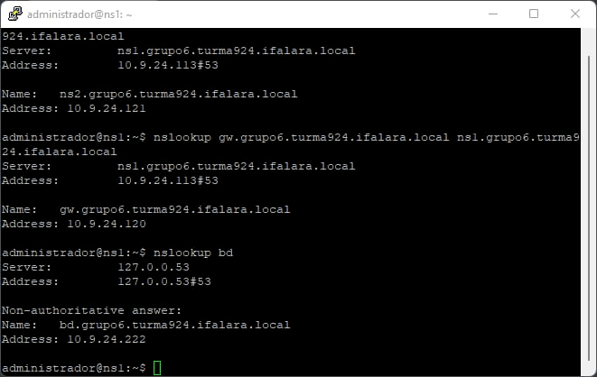
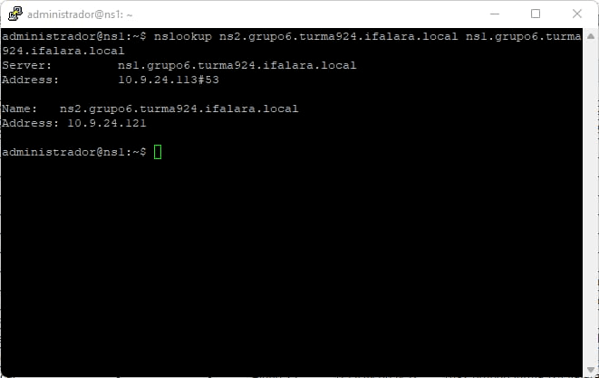
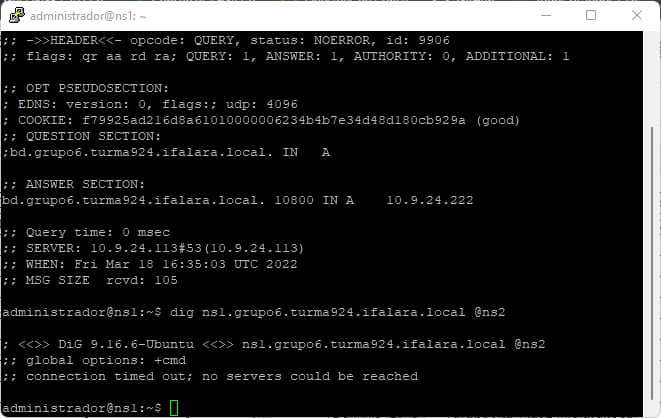
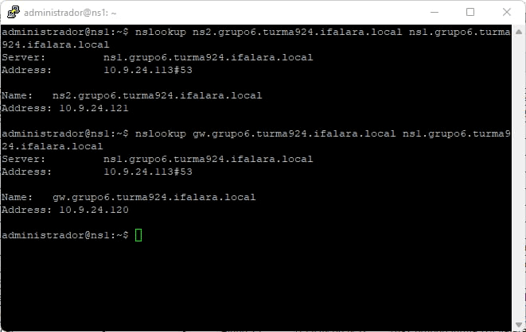
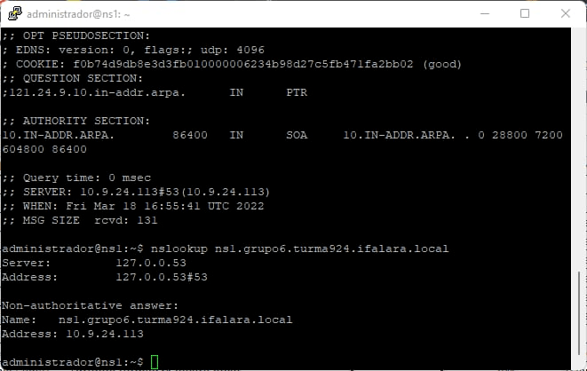


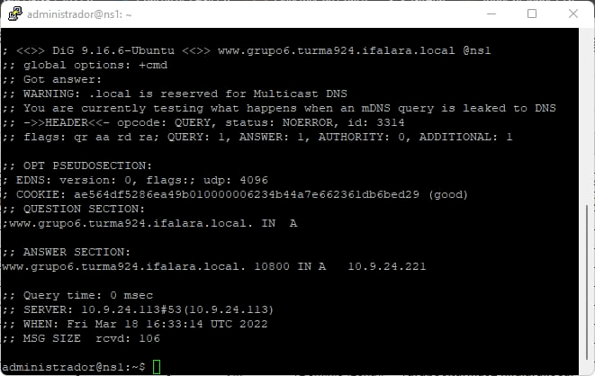

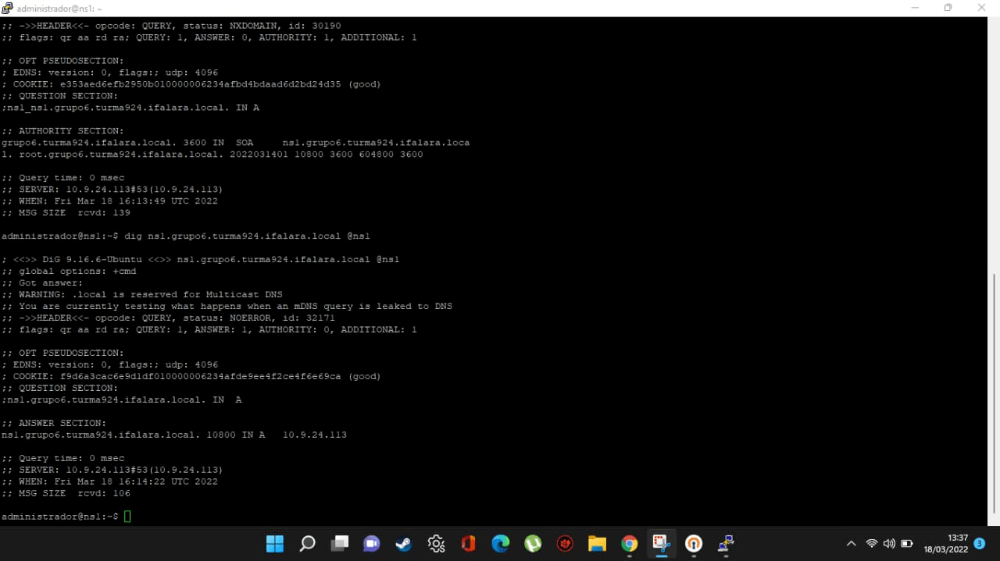
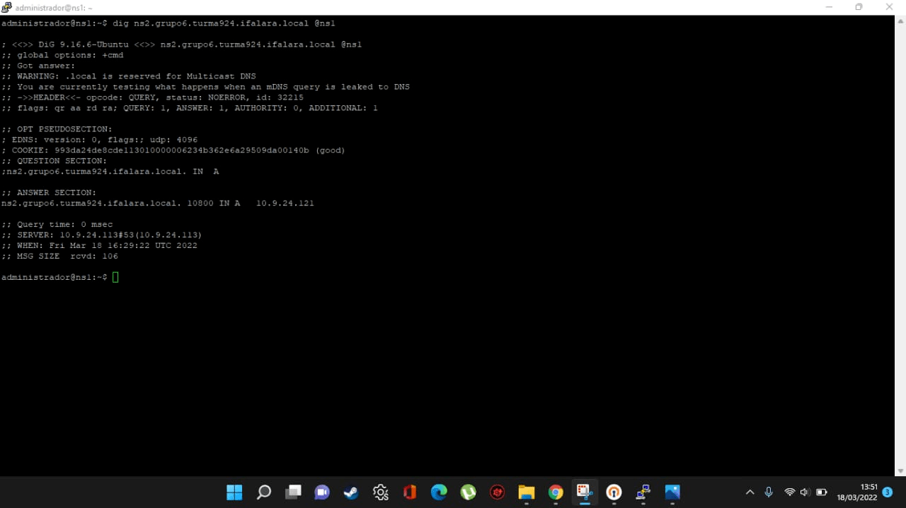
